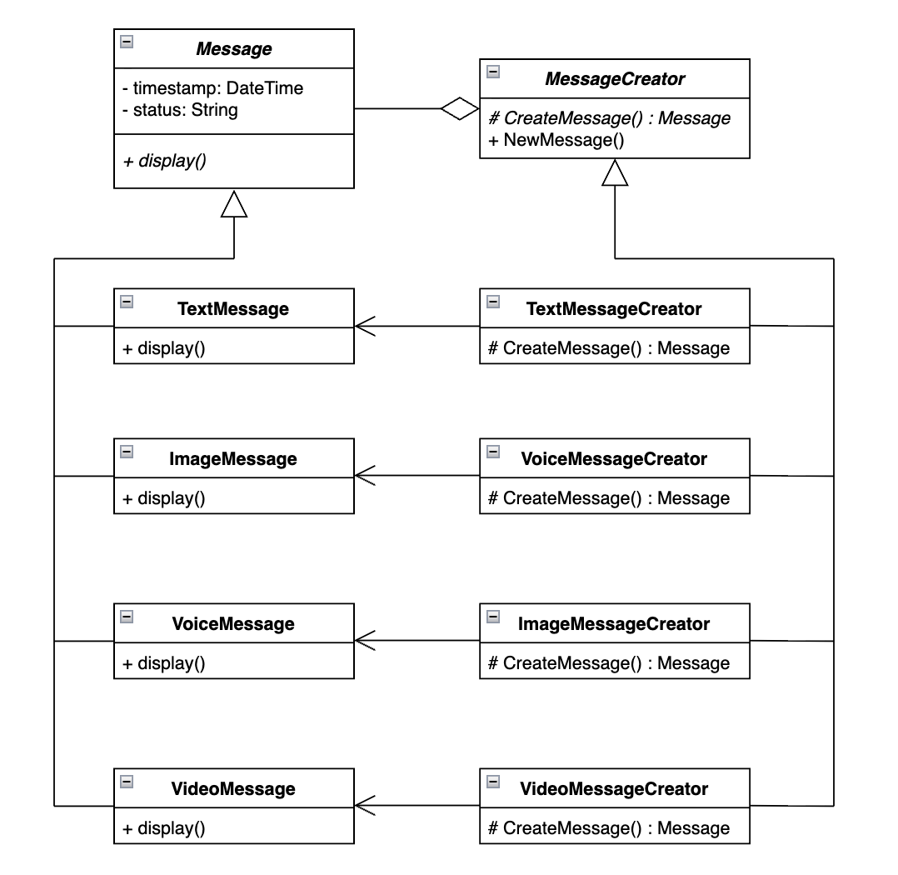

# Отчёт по лабораторной работе

## Порождающие паттерны: фабричный метод

### 1. Описание проблемы предметной области
В современных мессенджерах возникает необходимость поддержки разнообразных типов контента: простого текста, изображений, аудиозаписей и видеороликов. Основная проблема заключается в том, что основная логика приложения не может заранее знать, объекты каких именно классов ей придется создавать в ответ на действия пользователя.

Также каждый раз, когда я захочу добавить новый вид сообщения (например, видео), мне придется переписывать старую логику. Порождающие паттерны как раз нужны для того, чтобы система не зависела от того, как именно создаются её объекты.

---

### 2. Решение: как паттерн помог в проекте
Для решения этой проблемы нужно было реализовать паттерн «Фабричный метод». Его основная идея в том, чтобы создать общий интерфейс для объекта, но позволить другим классам самим решать, какой именно объект создавать.

Вот как я это сделал:
- Продукт (Product): Я создал общий класс Message, в котором описал общие свойства всех сообщений.
- Конкретные продукты: Для каждого типа (текст, фото, аудио, видео) я сделал отдельный класс, который наследуется от Message.
- Создатель (Creator): Я сделал класс MessageCreator, который объявляет метод CreateMessage.
- Конкретные создатели: У каждого типа сообщения есть своя «фабрика» (например, VideoMessageCreator), которая создает именно свой тип объекта.

Теперь основной код сайта вообще не знает детали того, как создаются сообщения, и работает с ними только через общий интерфейс.

---

### 3. Диаграмма классов

Рисунок 1 - Диаграмма классов для мессенджера

На схеме (Рисунок 1) видно, что у меня есть две параллельные ветки: одна отвечает за сами сообщения (левая часть), а вторая — за то, кто их создает (правая часть). Это позволяет системе быть гибкой.

---

### 4. Вывод
Благодаря внедрению фабричного метода, моя программа стал намного гибче. Мне было очень легко добавить отправку видео: я просто создал новый класс для видео и новую фабрику для него, не трогая старый код. Теперь все детали создания объектов скрыты, а основной код программы имеет дело только с общими интерфейсами.