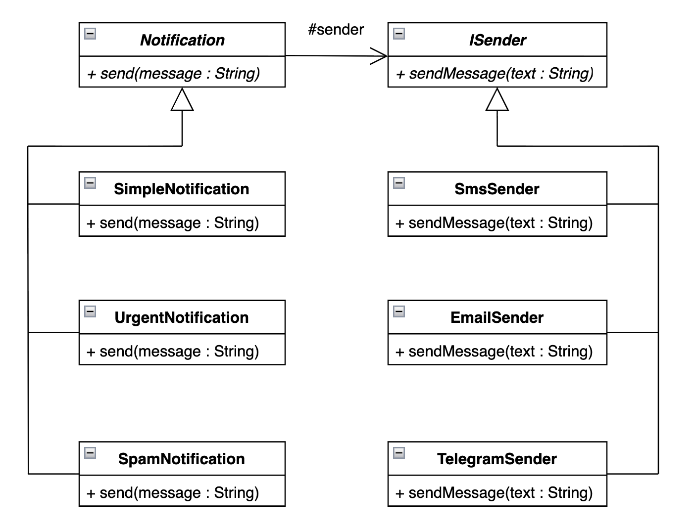

# Отчёт по лабораторной работе

## Структурные паттерны: Мост

### 1. Описание проблемы предметной области

В современных системах уведомлений часто требуется отправлять сообщения разными способами (email, SMS, Telegram) и с разной степенью срочности (обычное, срочное, спам). Если проектировать приложение без применения паттернов, то наиболее простым решением будет создать отдельный класс для каждой комбинации типа уведомления и канала доставки. Например, `EmailSimpleNotification`, `EmailUrgentNotification`, `SmsSimpleNotification`, `SmsUrgentNotification` и так далее.

При таком подходе количество классов растёт как произведение числа типов уведомлений на число каналов. Для трёх типов и трёх каналов это уже девять классов. Добавление нового канала (например, WhatsApp) потребует создания ещё трёх классов, а изменение логики форматирования сообщения придётся дублировать во всех классах. Это делает систему сложной в поддержке и расширении.

---

### 2. Решение: как паттерн помог в проекте

Паттерн «Мост» предлагает разделить абстракцию и реализацию, поместив их в разные иерархии классов и связав. В моём проекте я реализовал:

- **Implementor** (`ISender`) – интерфейс для всех способов отправки сообщений. Содержит метод `sendMessage(text)`.
- **ConcreteImplementor** (`EmailSender`, `SmsSender`, `TelegramSender`) – конкретные реализации отправки.
- **Abstraction** (`Notification`) – абстрактный класс, хранящий ссылку на объект `ISender` и определяющий общий интерфейс для отправки уведомлений.
- **RefinedAbstraction** (`SimpleNotification`, `UrgentNotification`, `SpamNotification`) – конкретные типы уведомлений, которые модифицируют сообщение и делегируют отправку реализатору.

Теперь, чтобы добавить новый канал (например, WhatsApp), достаточно создать класс `WhatsAppSender`, реализующий `ISender`, и использовать его с любым существующим уведомлением. Никакие другие классы не требуют изменений. Аналогично, для добавления нового типа уведомления. Количество классов теперь линейно, а не растёт мультипликативно.

---

### 3. Диаграмма классов

*Рисунок 1 – Диаграмма классов для сервиса уведомлений с применением паттерна Мост*

На диаграмме (Рисунок 1) представлены две независимые иерархии:
- **Иерархия реализаций**: интерфейс `ISender` и его наследники  `EmailSender`, `SmsSender`, `TelegramSender`.
- **Иерархия абстракций**: абстрактный класс `Notification` и его наследники `SimpleNotification`, `UrgentNotification`, `SpamNotification`.

Связь между ними осуществляется через ассоциацию: класс `Notification` содержит ссылку на объект `ISender`. Это позволяет уведомлению делегировать отправку конкретному каналу.

---

### 4. Вывод

Применение паттерна позволило полностью отделить абстракцию (типы уведомлений) от реализации (каналы доставки). Благодаря этому:
- Система стала гибкой и расширяемой – новые каналы и типы уведомлений добавляются без изменения существующего кода.
- Устранена проблема добавления классов – вместо девяти классов достаточно шести, и их число растёт линейно.