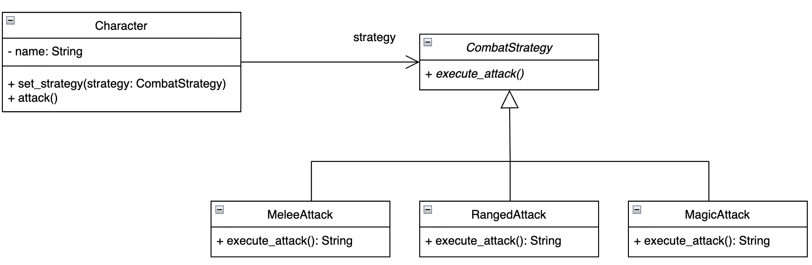

# Отчёт по лабораторной работе

## Поведенческие паттерны: Стратегия

### 1\. Описание проблемы предметной области

В игровой индустрии часто возникает задача реализации различных боевых механик для персонажей. Персонаж может атаковать врагов разными способами: холодным оружием, стрелами или магией. Если проектировать систему без использования паттернов, вся логика атак обычно сосредотачивается внутри одного класса персонажа в виде громоздких условных конструкций (`if-else` или `switch-case`).

При таком подходе класс персонажа становится перегруженным, так как он должен знать детали реализации каждой конкретной атаки — от расчета урона до визуальных эффектов. Добавление нового типа атаки (например, ядом или электричеством) требует изменения основного кода персонажа, что нарушает принцип открытости/закрытости.

-----

### 2\. Решение: как паттерн помог в проекте

Паттерн «Стратегия» позволяет инкапсулировать различные алгоритмы атаки в отдельные классы, делая их взаимозаменяемыми прямо во время выполнения программы. В моём проекте реализованы следующие компоненты:

  - **Strategy** (`CombatStrategy`) – абстрактный интерфейс, определяющий общий метод `execute_attack()` для всех типов атак.
  - **ConcreteStrategy** (`MeleeAttack`, `RangedAttack`, `MagicAttack`) – конкретные реализации атак. Каждая стратегия содержит свою логику визуализации и расчёта урона.
  - **Context** (`Character`) – класс персонажа, который хранит ссылку на текущий объект стратегии. Он не знает деталей атаки, а просто делегирует выполнение задачи объекту-стратегии.

Теперь персонаж может динамически менять свое поведение прямо в процессе игры через метод `set_strategy()`. Для добавления нового типа атаки достаточно создать новый класс, реализующий `CombatStrategy`, не затрагивая код самого персонажа или других атак. Это делает систему гибкой, а код — чистым и легко тестируемым.

-----

### 3\. Диаграмма классов

*Рисунок 1 – Диаграмма классов боевой системы персонажа с применением паттерна Стратегия*

На диаграмме (Рисунок 1) представлена структура взаимодействия:

  - **Класс Context (Character)**: содержит приватное поле `strategy` типа `CombatStrategy`. Агрегация позволяет персонажу использовать любую из доступных стратегий.
  - **CombatStrategy**: задает абстрактный метод `execute_attack()`.
  - **Конкретные стратегии**: классы `MeleeAttack`, `RangedAttack` и `MagicAttack` реализуют специфическое поведение атаки, возвращая результат в виде строки (или выполняя визуализацию на Canvas в GUI).

-----

### 4\. Вывод

Применение паттерна «Стратегия» позволило отделить высокоуровневую логику персонажа от низкоуровневых деталей реализации боевых алгоритмов. В результате:

  - **Повысилась гибкость**: персонаж может менять тип атаки «на лету» без пересоздания объекта.
  - **Улучшилась масштабируемость**: новые механики боя добавляются простым расширением иерархии стратегий без риска сломать существующий функционал.
  - **Соблюдены принципы SOLID**: каждый класс отвечает за свою конкретную задачу, а система открыта для расширения, но закрыта для модификации.