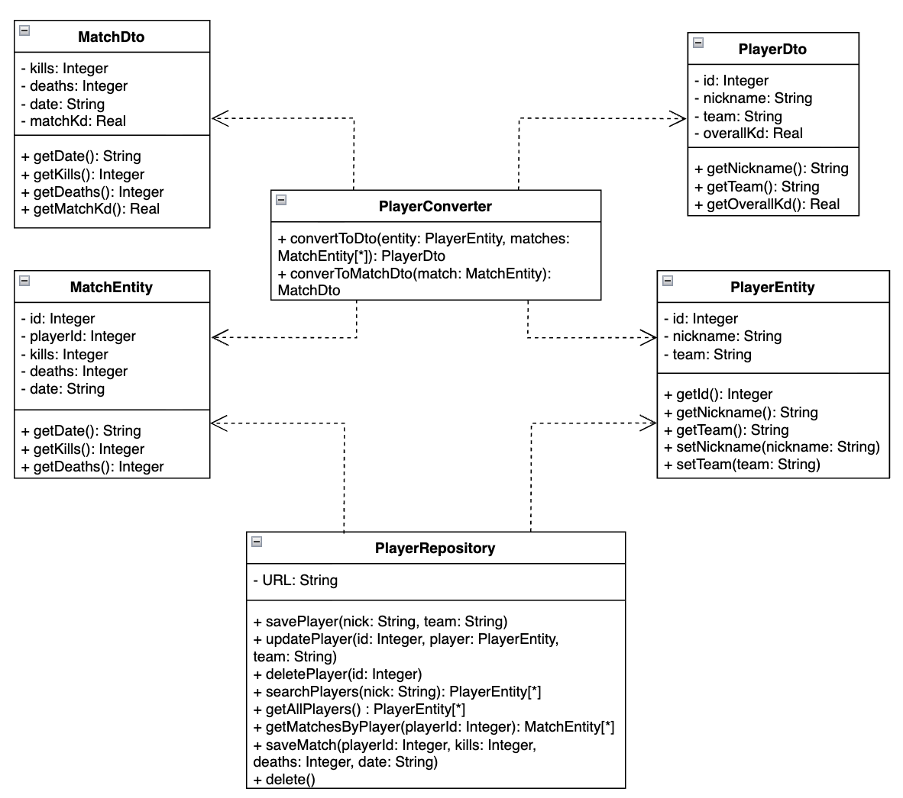

# Отчёт по лабораторной работе

## Архитектурные паттерны: Преобразователь

### 1. Описание проблемы предметной области

При разработке систем управления киберспортивными турнирами возникает задача эффективного управления данными игроков и их историей матчей. На уровне базы данных информация хранится в нормализованном виде в нескольких таблицах: `players` (личные данные, команда) и `matches` (результаты конкретных игр). 

Проблема заключается в том, что интерфейсу пользователя редко требуются «сырые» данные из БД. Для корректного отображения рейтинга необходимо агрегировать информацию: высчитывать средний коэффициент K/D по всем матчам игрока или вычислять K/D для конкретной встречи. Если разместить логику этих вычислений и форматирования прямо в классах базы данных или в коде GUI, система станет жестко связанной. Это затруднит добавление новых функций (например, расчет рейтинга по разным сезонам) и нарушит принцип единственной ответственности.

---

### 2. Решение: как паттерн помог в проекте

Паттерн «Преобразователь» позволил выделить логику трансформации и агрегации данных в отдельный слой, изолировав модель хранения от модели представления. В проекте реализованы следующие компоненты:

* **Entities (`PlayerEntity`, `MatchEntity`)**: Классы, точно описывающие структуру таблиц БД. Они отвечают только за хранение состояния.
* **DTOs (`PlayerDto`, `MatchDto`)**: Облегченные модели для GUI. `PlayerDto` содержит уже вычисленный `overallKd`, а `MatchDto` — результат конкретной игры с рассчитанным `matchKd`.
* **Converter (`PlayerConverter`)**: «Мозг» преобразования. Он принимает сущность и список связанных с ней матчей, выполняет математические расчеты и возвращает готовый объект для отображения.
* **Repository (`PlayerRepository`)**: Слой доступа к данным, реализующий CRUD-операции, поиск по никнейму и работу с реляционными связями (получение матчей конкретного игрока).

Благодаря этому GUI работает исключительно с DTO. Интерфейс «не знает», как именно считаются показатели или в каких таблицах лежат данные, что делает систему гибкой и легкой в поддержке.

---

### 3. Диаграмма классов

*Рисунок 1 – Диаграмма классов системы управления турнирной статистикой с применением паттерна Converter*

На диаграмме (Рисунок 1) представлена структура взаимодействия:

* **PlayerConverter**: Центральный узел, зависящий от всех моделей данных. Он реализует методы `convertToDto`и `convertToMatchDto`.
* **Связь сущностей**: `PlayerRepository` обеспечивает связь между игроками и их матчами, используя `id` игрока как внешний ключ.
* **Изоляция**: Модели `Entity` и `Dto` не имеют прямых связей, что гарантирует слабую связность слоев системы.

---

### 4. Вывод

Внедрение паттерна «Converter» позволило создать масштабируемую архитектуру, готовую к расширению функционала (например, добавлению новых видов статистики). В результате выполнения работы:

* **Разделены ответственности**: Расчеты вынесены из UI и моделей в специализированный конвертер.
* **Обеспечена безопасность данных**: Через DTO в интерфейс передаются только необходимые поля, скрывая внутреннюю структуру БД.
* **Соблюдены принципы SOLID**: Система открыта для расширения, но закрыта для модификации существующей бизнес-логики при изменении требований к визуализации.